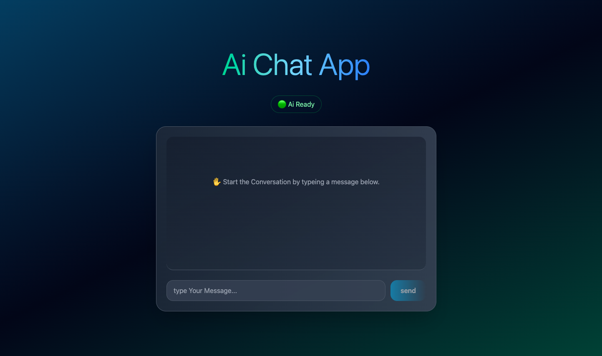

<div align="center">
#AiChatBot
</div>

--

## 🌟 What is Gemini Clone?

"Ai ChatBot" is a simple AI chatbot developed using "React" and "JavaScript." It is connected to "puter" or the "OpenRouter API" and responds to your queries with Ai.
This project is suitable for working with APIs and useState.

--

## 💡Feachers

- Simple user interface
- Fast response
- Support for multiple languages
- Connected to puter and OpenRouter API

--

## ⚙️ Getting Started

1. **Clone the project:**
   ```bash
   git clone https://github.com/AbolfazlV2/AiChatApp.git
   ```
2. **Move the folder:**

   ```bash
   cd AiChatBot
   ```

3. **Install packages:**

   ```bash
   npm install
   ```

4. **notice:**

-- This ChatBot was developed with puter and the OpenRouter API.  
--1.To use puter mode, without an API: Go to "WithPuter" branch.  
--2.To use the OpenRouter API mode: Go to the "main" or "WithOpenAi-Api" branch and follow the steps below.

5. **Set up your API key:**

   - Generate a .env.local file in the root directory.
   - Include the following line with your [OpenRouter](http://localhost:5173) API key:

     ```env
     VITE_OPENROUTER_API_KEY = "Your Api"
     ```

6. **Run the app:**

   ```bash
   vite
   ```

7. **Go to browser:**

   ## Go to [http://localhost:5173](http://localhost:5173)

## Preview

